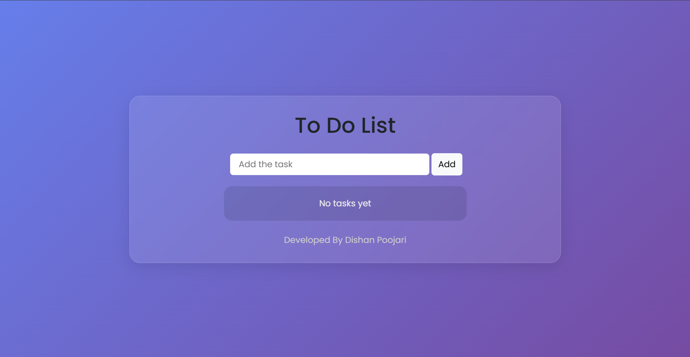

# ✅ To-do list

A simple and interactive to-do list application built with vanilla **HTML**, **CSS**, and **JavaScript**. Perfect for managing daily tasks and staying organized!

## 🚀 Live Demo

[View Live Project](https://dishan033.github.io/Flip-a-coin/)

## 📸 Screenshot

 

## 🛠️ Technologies Used

- **HTML5** - Structure and markup
- **CSS3** - Styling and animations
- **JavaScript (ES6)** - Interactive functionality and coin flip logic

## ✨ Features

- ➕ Add new tasks easily  
- 📝 Edit or update existing tasks  
- ✅ Mark tasks as completed  
- 🗑️ Delete tasks individually  
- 📱 Responsive design for all devices  

## 🎮 How to Use

1. Type your task into the input field.  
2. Click the “Add” button or press **Enter** to add it to your list.  
3. Mark tasks as complete by checking the box.  
4. Use the edit or delete icons to modify or remove tasks.  

## 🏗️ Project Structure

```
to-do-list/
│
├── index.html          # Main HTML file
├── styles.css          # CSS styles and animations
├── script.js           # JavaScript functionality
└── README.md           # Project documentation
```

## 🚀 Getting Started

### Prerequisites

- A modern web browser
- Basic understanding of HTML, CSS, and JavaScript (for development)

### Installation

1. Clone the repository:
   ```bash
   git clone https://github.com/dishan033/To-do-list.git
   ```

2. Navigate to the project directory:
   ```bash
   cd To-do-list
   ```

3. Open `index.html` in your web browser or use a live server extension

## 💻 Code Highlights

- **Pure JavaScript**: No external libraries or frameworks
- **CSS Animations**: Smooth coin flip transitions
- **Responsive Design**: Works on desktop, tablet, and mobile
- **Clean Code**: Well-structured and commented

## 💻 Code Highlights

This project demonstrates:

- Event Handling: Add, edit, delete, and complete tasks
- Responsive Design: Works on desktop, tablet, and mobile
- Clean Code: Well-structured and commented

## 🤝 Contributing

This is a beginner-friendly project! Feel free to:

1. Fork the project
2. Create a feature branch (`git checkout -b feature/AmazingFeature`)
3. Commit your changes (`git commit -m 'Add some AmazingFeature'`)
4. Push to the branch (`git push origin feature/AmazingFeature`)
5. Open a Pull Request

## 📝 License

This project is open source and available under the [MIT License](LICENSE).

## 👨‍💻 Author

**Dishan Poojari**
- GitHub: [dishan033](https://github.com/dishan033)
- LinkedIn: [Dishan Poojari](https://www.linkedin.com/in/dishan-poojari/)

## 🙏 Acknowledgments

- Thanks to the web development community for inspiration
- Built as part of my front-end development journey
  
---

⭐ **If you found this project helpful, please give it a star!** ⭐
